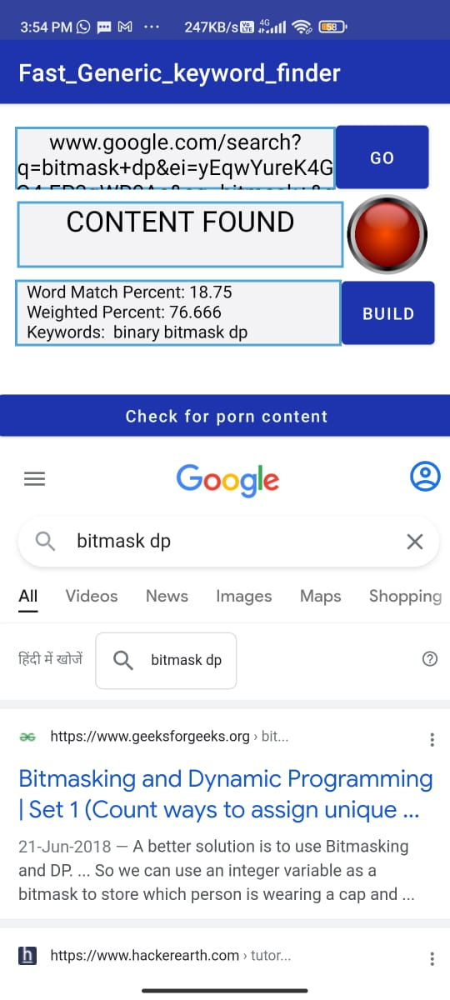
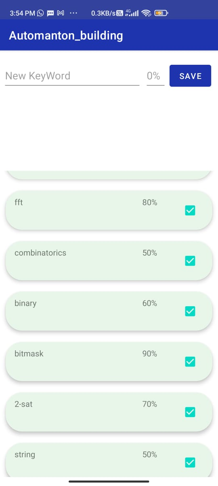
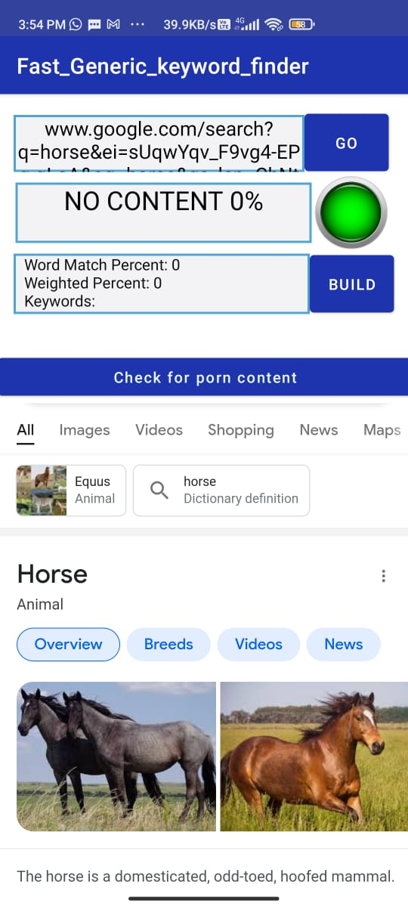
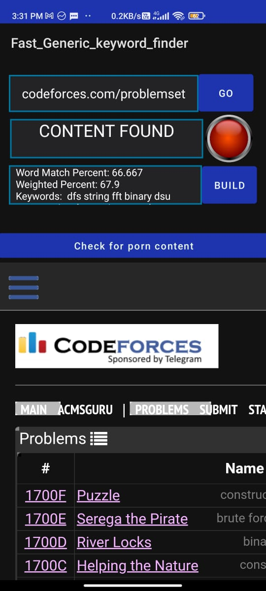
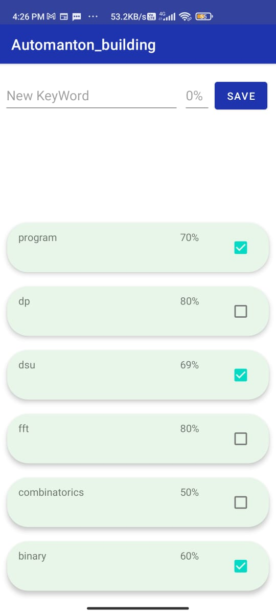

# Fast_Generic_keyword_finder
- Android Browser with inbuilt functionality for keywords-set detection by creating suffix automanton over keywords-set using Aho-Corasick algorithm.

- While interacting with in_built browser, user can check for the keywords-set members in text content on the current page in browser which also reflects
the type of page and for letting the user know if it's compitable with user's requirement.

- User with his own choice can add any word in the keyword-set and may select or unselect the keyword or delete the keyword in keyword-set as per his requirement.

- Keyword database is built in NoSQL mongoDB Realm Android Database which is faster than SQLlite etc.

- One application of this Generic Fast Keyword finder is " User can make all the keywords in Keyword-set NSFW words like sex,etc which can reflect if a page 
particular webpage contains NSFW material and upto what extent"

- Average case complexity for this task using this algorithm is almost O(num of keywords) time faster than other pattern matching algorithms like KMP,
Rabin-karp(Rolling hash), etc.

## Mobile Application Sceenshots

|                  CONTENT FOUND                    |                 KEYWORDS-SET                      |                 NO CONTENT FOUND                  |
|:-------------------------------------------------:|:-------------------------------------------------:|:-------------------------------------------------:|
|  |  |  |

|                 CONTENT FOUND                     |                 CONTENT FOUND                     |            SELECT/UNSELECT KEYWORD                |
|:-------------------------------------------------:|:-------------------------------------------------:|:-------------------------------------------------:|    
|  |  |  |         
